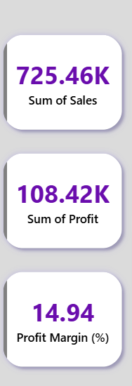
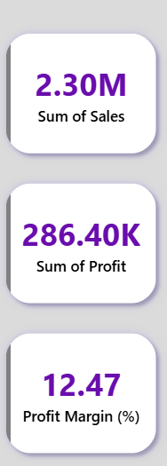
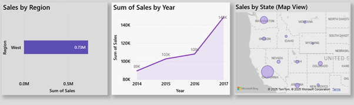
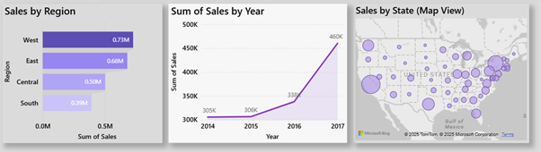

# Superstore Sales Dashboard using Python & Power BI

## 📊 Project Overview
This project analyzes Superstore retail sales data to identify trends, profit margins, and regional performance. The goal is to provide actionable insights through an interactive dashboard.

## 🛠 Tools Used
- **Python (Pandas, Matplotlib)** – for data cleaning, analysis, and visualization  
- **Power BI** – for creating interactive dashboards  
- **DAX** – for calculating KPIs and measures  

## ⚙️ Key Steps
1. Imported and cleaned the Superstore sales dataset using Python.  
2. Analyzed trends by category, sub-category, region, and profit.  
3. Calculated KPIs such as Total Sales, Profit by Sub-Category, and Regional Sales using DAX.  
4. Built an interactive Power BI dashboard with charts, filters, and visuals.  

## 📈 Dashboard Highlights
- KPIs: Total Sales, Profit, Regional Performance  
- Visuals: Category-wise Sales, Sub-Category Profit, Regional Sales Comparison  
- Interactive filters for detailed exploration  

## 🖼️ Dashboard Screenshots

## 📂 Project File
You can explore or download the dashboard here:  
👉 [Superstore_Dashboard.pbix](Superstore_Dashboard.pbix)
---
**Author:** Iffath 
**Project Type:** Data Analysis / Business Intelligence
